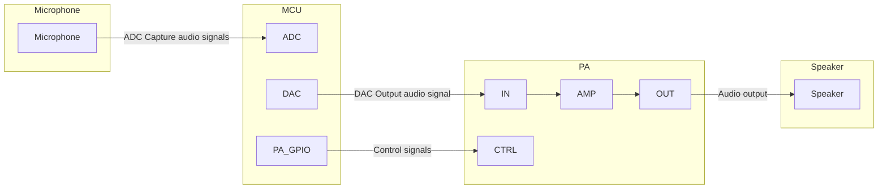
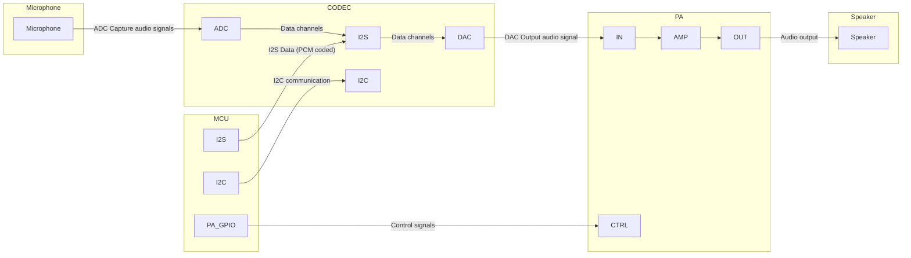
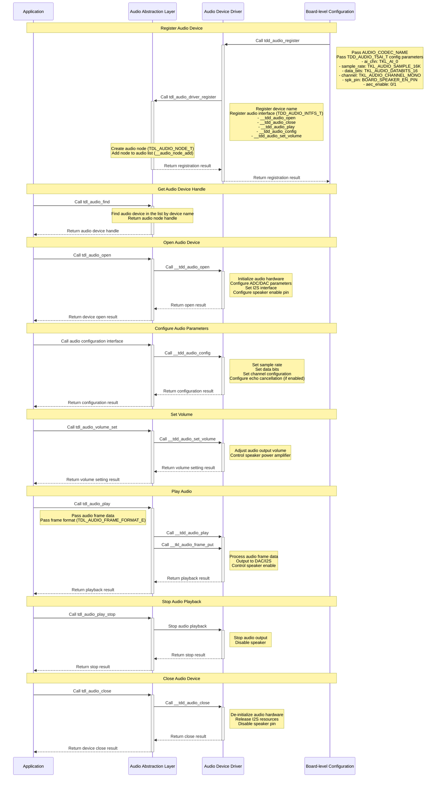

# Audio Driver

## Introduction
The [Audio Driver](https://github.com/tuya/TuyaOpen/tree/master/src/peripherals/audio_codecs) is a core component in TuyaOpen used for handling audio input and output. It provides a unified interface to manage different types of audio devices, such as microphones and speakers. Through this driver, applications can easily perform audio capture, playback, and configuration without needing to be concerned with the specific implementation details of the underlying hardware.

## Prerequisite Concepts

| Term | Explanation |
| --- | :--- |
| MIC(Microphone) | A microphone is a transducer that converts sound signals into electrical signals. |
| SPK(Speaker) | A speaker is a device that converts electrical signals into sound signals. |
| CODEC(Codec) | A CODEC typically consists of two main parts:<br />**Encoder** Converts raw data (like uncompressed audio or video) into another format for easier storage or transmission.<br />**Decoder** Restores the encoded data to its original format for viewing or playback. |
| PA(Power Amplifier) | A PA is an electronic device whose main function is to amplify the power of a weak input signal so that it can drive a larger load, such as a speaker or antenna. |
| PCM | PCM is a method of encoding analog audio signals into digital signals. The raw PCM data (often called a PCM stream or raw data) is uncompressed and needs to be decoded before it can be played. |
| PDM | PDM is also a digital audio encoding method, characterized by having only one bit of data, using the density of pulses to represent the intensity of the analog signal. |
| I2C | Primarily used for control signals, configuration parameters, and small amounts of data transfer between chips, using two lines for communication: SDA (Serial Data) and SCL (Serial Clock). |
| I2S | Specifically used for the transmission of digital audio data, using at least three lines, including SCK (Serial Clock), WS (Word Select), and SD (Serial Data). |
| ADC | Converts analog signals (such as sound, light, temperature, etc.) into digital signals for processing, storage, and transmission by computers or other digital systems. The `AD` conversion process typically includes three steps: sampling, quantization, and encoding (such as PCM encoding). |
| DAC | Converts digital signals (from computers, MP3 players, etc.) into analog signals to drive analog devices such as speakers and displays. The `DA` conversion process typically generates a corresponding analog voltage or current output based on the value of the digital signal. |

## Audio Connection Framework

The audio connection framework varies depending on the main control chip. For example, the `T5AI` has built-in ADC and DAC interfaces and can implement an audio system without a CODEC chip. In contrast, the `ESP32-S3` does not support DAC and requires an external CODEC chip to build an audio system.

### Hardware Framework for Audio Devices with Built-in CODEC



### Hardware Framework for Audio Devices with External CODEC



## Functional Modules

TuyaOpen aims to provide a standardized, platform-independent audio solution with a core design philosophy of layered decoupling. It separates the application layer's audio requirements from the underlying specific hardware implementation.

*   **For Application Developers**: Regardless of whether the underlying chip is a T5AI or another audio codec, the application layer only needs to call a unified, standardized set of APIs (the tdl_audio_xxx series of functions), such as tdl_audio_open, tdl_audio_play, etc. This greatly reduces the complexity of application development and improves code portability.
*   **For Driver Developers**: When a new audio chip needs to be supported, one only needs to follow the standard interface defined in `tdl_audio_driver.h` to write a new TDD layer driver (similar to `tdd_audio.c`) and register it with the TDL management layer, without modifying any application layer code.

### Abstract Management Module: TDL (Tuya Driver Layer)

This is the highest level of abstraction, providing a unified audio service interface to the application layer.

*   tdl_audio_manage.c/h: Implements the core of audio driver management. It maintains a linked list for registering and managing different types (or different platforms) of audio device drivers. Applications use audio functions by calling tdl_audio_find, tdl_audio_open, etc., without needing to know the underlying implementation details.
*   tdl_audio_driver.h: Defines the "standardized interface" (TDD_AUDIO_INTFS_T) that all audio device drivers must adhere to, including function pointers for open, play, config, close, etc. This ensures that tdl_audio_manage can uniformly call any underlying driver that conforms to this standard.

### Instantiation and Registration Module: TDD (Tuya Device Driver)

This is the middle layer of the driver, representing the specific implementation for a particular hardware platform.

*   tdd_audio.c/h: Implements the audio driver for different platforms. It is responsible for connecting the upper and lower layers, implementing the TDD_AUDIO_INTFS_T standard interface defined by TDL, and calling the TKL layer or the original manufacturer's hardware abstraction interface to control the actual hardware. The tdd_audio_register function registers this driver's implementation (function pointers) with the TDL layer.

## Feature Introduction

**a. Audio Input (Microphone Capture)**

*   **Start and Stop**: Audio capture can be started and stopped using tdl_audio_open and tdl_audio_close.
*   **Asynchronous Data Callback**: The driver uses a callback mechanism (TDL_AUDIO_MIC_CB) to push the captured audio data to the application layer frame by frame in real-time. The application layer does not need to actively read the data but passively receives it, which is more efficient.
*   **Status Notification**: The callback function not only transmits audio data but also the current status (TDL_AUDIO_STATUS_E), for example, it can notify the application of "Voice Activity Detected (VAD_START)" or "Voice Activity Ended (VAD_END)".

**b. Audio Output (Speaker Playback)**

*   **Play Audio Stream**: The application layer can send audio data blocks in formats like PCM to the driver for playback by calling the tdl_audio_play function.
*   **Control Playback**: The tdl_audio_play_stop function can be called at any time to clear the playback buffer and immediately stop the currently playing audio.

**c. Volume Control**

*   **Set Volume**: The playback volume of the speaker can be dynamically adjusted at runtime (range 0-100) using the tdl_audio_volume_set function.

**d. Echo Cancellation (AEC) Support**

*   **Configurable AEC**: When initializing the audio device, you can choose to enable or disable the acoustic echo cancellation function (requires hardware support) through a configuration option (aec_enable).
*   **Improved Call Experience**: AEC is a key technology for achieving full-duplex voice calls (i.e., speaking and listening at the same time without producing echo). This driver has built-in support for AEC, enabling it to meet the needs of advanced applications such as voice intercom and video calls.

**e. Extensible Driver Management**

*   **Dynamic Registration and Discovery**: The system can register multiple different audio drivers simultaneously (e.g., an onboard Codec, an external USB sound card).
*   **Find by Name**: The application layer can find and obtain a handle to a specific audio device (tdl_audio_find) using a string name (e.g., "audio_codec"), enabling flexible device selection.

## Supported Peripherals List

| CODEC | Recording | Playback |
| :---: | :---: | :---: |
| ES8311 | ✅ | ✅ |
| ES8388 | ✅ | ✅ |
| ES8389 | ✅ | ✅ |
| ··· | | |

## Workflow

Taking T5AI as an example, this section introduces the workflow of the audio driver framework.



## Development Guide

### Kconfig Configuration

To include the driver in the build, you need to check if the relevant Kconfig options are enabled before compiling. In the target project path, execute `tos.py config menu` in the terminal to view the following configuration options.

| Configuration Macro | Type | Description |
| :--- | :--- | :--- |
| enable audio codecs | Boolean | The driver code will only be compiled if this macro is enabled. |
| audio support AEC | Boolean | Enable AEC function (requires hardware support). |
| the name of audio codec | String | Configure the device name of the CODEC. |
| the num of audio codecs | Integer | Configure the number of board-level CODECs. |


:::tip
The above configuration items must be supported in `src/peripherals/audio_codecs/Kconfig` and `boards/<target_platform>/<target_board>/Kconfig` (check the Kconfig file for your target board). If you do not find the relevant configuration items, please check the contents of these two files.
:::

### Runtime Environment

To run this driver, you need to first enable the **main enable macro** `<ENABLE_AUDIO_CODECS>`. There are three ways to enable this macro: **Board default enabled**, **enabled a feature that requires the screen driver**, and **manually enabled**.

:::warning

All the following commands need to be executed in the target application directory. Do not execute them directly in the TuyaOpen root directory or other directories, otherwise an error will be reported.

:::

#### Target Board Default Enabled

:::info

In this case, the developer's chosen development board has usually already registered the screen device. At this time, the source file in the target Board has already written the registration code.

For example, the TUYA_T5AI_EVB development board supports a microphone and speaker. When adapting this board, the audio device has already been registered, and the `boards/T5AI/TUYA_T5AI_EVB/Kconfig` file will also have `select ENABLE_AUDIO_CODECS`. (For specific example code and configuration, please refer to `boards/T5AI/TUYA_T5AI_EVB`).

:::

This means that as long as the developer selects the corresponding target Board, the driver will be automatically enabled.

*   Execute the command to enter the Kconfig menu

    ```shell
    tos.py config menu
    ```

:::warning

After executing `select ENABLE_XXX` in boards/T5AI/TUYA_T5AI_EVB/Kconfig, you cannot manually select/deselect it by executing `tos.py config menu`.

:::

#### Enabled a feature that requires the audio driver

If the developer selects a feature that depends on the audio driver, the enable macro for the audio driver will also be automatically enabled.

#### Manually enable the macro

*   Execute the command to enter the Kconfig menu

    ```shell
    tos.py config menu
    ```

*   Enable the driver enable macro


### How to Use

#### Adapting the Audio Driver

:::tip

Developers can skip this step if they find a corresponding driver in [tdd_audio](https://github.com/tuya/TuyaOpen/tree/master/boards/ESP32/common/audio). If you cannot find a suitable audio driver for yourself, you can adapt the driver yourself.

:::

1.  Create `tdd_audio_xxx.c/h` files in `src/peripherals/audio_codecs/tdd_audio`.
2.  **Allocate memory** for the device and adapt the abstract interface of the audio driver (function pointers such as open, close, play, config, etc.) according to your device.
3.  Call the **register common audio device node** interface (tdl_audio_driver_register()).
4.  For example code, please refer to the already adapted drivers.

```c
OPERATE_RET tdd_audio_register(char *name, TDD_AUDIO_T5AI_T cfg)
{
    OPERATE_RET rt = OPRT_OK;
    
    TDD_AUDIO_DATA_HANDLE_T *_hdl = NULL;
    TDD_AUDIO_INTFS_T intfs = {0};

    /* Allocate memory to the device */
    _hdl = (TDD_AUDIO_DATA_HANDLE_T *)tal_malloc(sizeof(TDD_AUDIO_DATA_HANDLE_T));
    memset(_hdl, 0, sizeof(TDD_AUDIO_DATA_HANDLE_T));
    g_tdd_audio_hdl = _hdl;
    _hdl->play_volume = 80;
    memcpy(&_hdl->cfg, &cfg, sizeof(TDD_AUDIO_T5AI_T));

    /* Register function pointers */
    intfs.open = __tdd_audio_open;
    intfs.play = __tdd_audio_play;
    intfs.config = __tdd_audio_config;
    intfs.close = __tdd_audio_close;

    tdl_audio_driver_register(name, &intfs, (TDD_AUDIO_HANDLE_T)_hdl);
    return rt;
}
```

:::warning

When adapting for ESP32, you need to create new files in the `boards/ESP32/common/audio` path. The CODEC chips that have been adapted for ESP32 are also in this path.

:::

#### Registering the Audio Device

:::tip

If the developer's chosen target Board has already registered the audio device, they only need to select the target board in Kconfig and call the `board_register_hardware()` interface in the application. This interface has already registered the corresponding audio device.

:::

1.  Write the registration interface according to the developer's audio CODEC model and connection pins. It is recommended to write it in `board_register_hardware()`, the implementation path of this interface is `boards/<target_platform>/<target_board>/xxx.c`.
2.  Configure the basic information of the device and call the registration interface in `board_register_hardware()`.

```c
OPERATE_RET __board_register_audio(void)
{
    /* Write your struct configuration information here */
    /* begin */
    
    /* end */
    TUYA_CALL_ERR_RETURN(tdd_audio_register(AUDIO_CODEC_NAME, cfg));
    return rt;
}

OPERATE_RET board_register_hardware(void)
{
	TUYA_CALL_ERR_LOG(__board_register_audio());
	return rt;
}
```

#### Controlling the Device

Control the audio device according to the tdl layer interface provided in `src/peripherals/audio_codecs/tdl_audio/include/tdl_audio_manage.h`.

*   Find the device handle by device name
*   Open and initialize the audio device
*   Close the audio device and release related resources
*   Dynamically adjust the audio output volume
*   Play audio data
*   Stop playing audio data

For specific examples, please refer to `examples/multimedia/audio`.

## API Reference

### Audio Device Configuration Structure

Taking T5AI as an example, construct the TDD layer hardware configuration information structure.

```c
/**
 * @brief Audio device configuration structure for T5AI board.
 * 
 * This structure contains all hardware configuration parameters for the audio device,
 * including sample rate, data bits, channels, speaker control pins, and AEC settings.
 */
typedef struct {
    uint8_t aec_enable;
    TKL_AI_CHN_E ai_chn;
    TKL_AUDIO_SAMPLE_E sample_rate;
    TKL_AUDIO_DATABITS_E data_bits;
    TKL_AUDIO_CHANNEL_E channel;

    // spk
    TKL_AUDIO_SAMPLE_E spk_sample_rate;
    int spk_pin;
    int spk_pin_polarity;
} TDD_AUDIO_T5AI_T;
```

### Audio Driver Registration Structure

To register the audio driver structure, developers need to implement the corresponding function pointers according to their own audio driver.

```c
/**
 * @brief Audio driver interface structure.
 * 
 * This structure contains function pointers for all audio operations, providing
 * a unified interface for the audio abstract layer to call driver functions.
 */
typedef struct {
    OPERATE_RET (*open)(TDD_AUDIO_HANDLE_T handle, TDL_AUDIO_MIC_CB mic_cb);
    OPERATE_RET (*play)(TDD_AUDIO_HANDLE_T handle, uint8_t *data, uint32_t len);
    OPERATE_RET (*config)(TDD_AUDIO_HANDLE_T handle, TDD_AUDIO_CMD_E cmd, void *args);
    OPERATE_RET (*close)(TDD_AUDIO_HANDLE_T handle);
} TDD_AUDIO_INTFS_T;
```

### Audio Device Registration Interface

This interface is used to register the audio device driver with the system and is the entry point of the audio driver framework. By passing in the device name and configuration parameters, the audio device is added to the management list for use by the application.

```c
/**
 * @brief Registers an audio device driver with the audio management system.
 * 
 * This function registers an audio device driver including device name, hardware 
 * configuration parameters, and driver interface functions. After successful 
 * registration, applications can find and use the audio device by name.
 * 
 * @param name Audio device name used for identification and lookup
 * @param cfg Audio device configuration parameters including sample rate, data bits, 
 *            channels, speaker pin configuration, etc.
 * 
 * @return Returns OPRT_OK on successful registration, or an appropriate error code on failure.
 */
OPERATE_RET tdd_audio_register(const char *name, TDD_AUDIO_T5AI_T cfg);
```

### Audio Driver Registration Interface

This interface registers the underlying audio driver interface with the abstraction layer management system, creates device nodes, and maintains the device list.

```c
/**
 * @brief Registers audio device driver interfaces to the abstract layer management system.
 * 
 * This function registers audio device driver interface functions to the audio abstract 
 * layer management system, creates device nodes and adds them to the device management list 
 * for upper layer application calls.
 * 
 * @param name Audio device name
 * @param intfs Audio driver interface structure containing various operation function pointers
 * 
 * @return Returns OPRT_OK on successful registration, or an appropriate error code on failure.
 */
OPERATE_RET tdl_audio_driver_register(const char *name, TDD_AUDIO_INTFS_T *intfs);

```

### Device Find and Management Interface

This interface finds the corresponding device handle in the registered audio device list according to the device name, and is the key interface for obtaining device control.

```c
/**
 * @brief Finds an audio device by device name.
 * 
 * This function searches for the corresponding audio device node in the registered 
 * audio device list based on the device name, and returns a device handle for 
 * subsequent operations.
 * 
 * @param name Name of the audio device to find
 * 
 * @return Returns audio device handle, or NULL if not found.
 */
TDL_AUDIO_HANDLE_T tdl_audio_find(const char *name);

```

### Device Open Interface

This interface opens and initializes the audio device, including hardware initialization, pin configuration, and other operations, to make the device available.

```c
/**
 * @brief Opens and initializes an audio device.
 * 
 * This function opens the specified audio device and initializes audio hardware 
 * including ADC/DAC, I2S interface, speaker enable pins, etc. After successful 
 * opening, the device enters a usable state.
 * 
 * @param audio_hdl Audio device handle
 * 
 * @return Returns OPRT_OK on successful opening, or an appropriate error code on failure.
 */
OPERATE_RET tdl_audio_open(TDL_AUDIO_HANDLE_T audio_hdl);

```

### Device Close Interface

This interface closes the audio device and releases related resources, including de-initializing the hardware and disabling pins.

```c
/**
 * @brief Closes and deinitializes an audio device.
 * 
 * This function closes the specified audio device and deinitializes audio hardware 
 * including releasing I2S resources, disabling speaker pins, closing ADC/DAC, etc. 
 * After closing, the device becomes unavailable and needs to be reopened for use.
 * 
 * @param audio_hdl Audio device handle
 * 
 * @return Returns OPRT_OK on successful closing, or an appropriate error code on failure.
 */
OPERATE_RET tdl_audio_close(TDL_AUDIO_HANDLE_T audio_hdl);

```

### Volume Adjustment Interface

This interface is used to dynamically adjust the audio output volume and control the gain of the speaker power amplifier.

```c
/**
 * @brief Sets audio output volume.
 * 
 * This function adjusts the output volume of the audio device, controls the gain 
 * of the speaker amplifier, and implements dynamic volume adjustment functionality.
 * 
 * @param audio_hdl Audio device handle
 * @param volume Volume value, typically ranging from 0-100
 * 
 * @return Returns OPRT_OK on successful setting, or an appropriate error code on failure.
 */
OPERATE_RET tdl_audio_volume_set(TDL_AUDIO_HANDLE_T audio_hdl, uint8_t volume);

```

### Audio Playback Control Interface

This interface is used to play audio data, outputting audio frames to the speaker through the hardware interface.

```c
/**
 * @brief Plays audio data.
 * 
 * This function sends audio frame data to the audio device for playback. Data is 
 * output to the speaker through DAC or I2S interface. Supports different audio 
 * frame formats.
 * 
 * @param audio_hdl Audio device handle
 * @param frame_data Audio frame data pointer
 * @param frame_size Audio frame data size
 * @param format Audio frame format
 * 
 * @return Returns OPRT_OK on successful playback, or an appropriate error code on failure.
 */
OPERATE_RET tdl_audio_play(TDL_AUDIO_HANDLE_T audio_hdl, void *frame_data, uint32_t frame_size,
                           TDL_AUDIO_FRAME_FORMAT_E format);

```

### Audio Stop Playback Interface

This interface is used to stop the current audio playback, turn off the audio output, and put the device into a mute state.

```c
/**
 * @brief Stops audio playback.
 * 
 * This function stops the currently ongoing audio playback, closes audio output, 
 * disables speaker amplifier, and puts the device into a mute state.
 * 
 * @param audio_hdl Audio device handle
 * 
 * @return Returns OPRT_OK on successful stopping, or an appropriate error code on failure.
 */
OPERATE_RET tdl_audio_play_stop(TDL_AUDIO_HANDLE_T audio_hdl);

```
