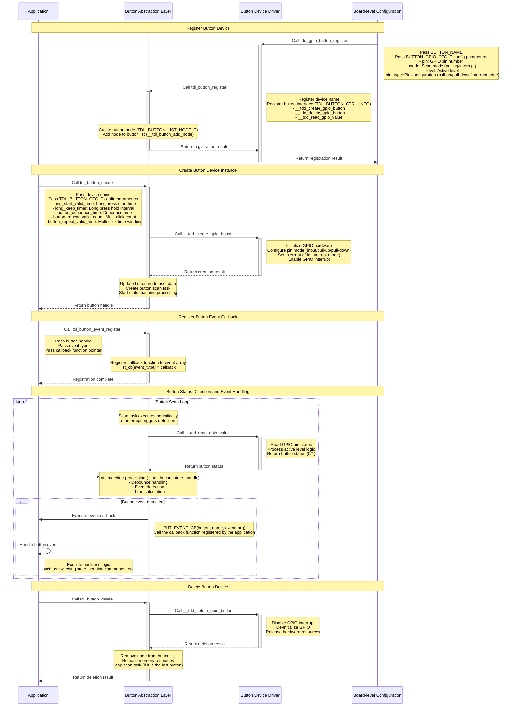
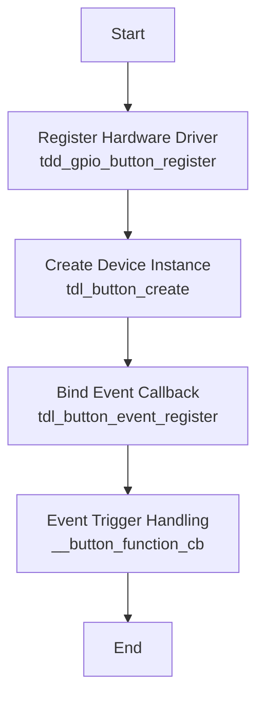

# Button Driver

## Introduction
The [Button Driver](https://github.com/tuya/TuyaOpen/tree/master/src/peripherals/button) is a core component in TuyaOpen for handling user input. It provides a unified interface to manage different types of button devices and supports various button event detection and handling mechanisms. With this driver, applications can easily implement button input detection, event handling, and state management without worrying about the specific implementation details of the underlying hardware.

## Prerequisite Concepts

| Term | Explanation |
| --- | :--- |
| GPIO | General Purpose Input/Output pin, used to connect external devices such as buttons |
| Debounce | Buttons produce mechanical bouncing when pressed or released, which needs to be eliminated by software or hardware |
| Pull-up/Pull-down | The level configuration of a GPIO pin, used to determine the default state when the button is not pressed |
| Interrupt | An asynchronous notification mechanism triggered by a hardware event, which can achieve low-power button detection |
| Polling | A detection method that periodically checks the button status, suitable for simple application scenarios |
| Active Level | The level state of the GPIO pin when the button is pressed, which can be configured to be active high or active low |
| Edge Trigger | The interrupt trigger mode, which can be configured as rising edge, falling edge, or dual edge trigger |
| State Machine | A logical control mechanism used to manage button event detection and handling |

## Button Connection Framework

Depending on the hardware design, the button connection method will also be different. Common connection methods include pull-up buttons and pull-down buttons.

### Pull-up Button Connection Framework


### Pull-down Button Connection Framework


## Functional Modules

TuyaOpen aims to provide a standardized, platform-independent button solution with a core design philosophy of layered decoupling. It separates the application layer's button requirements from the underlying specific hardware implementation.

* **For Application Developers**: Regardless of which chip's GPIO is used at the bottom layer, the application layer only needs to call a unified, standardized set of APIs (the tdl_button_xxx series of functions), such as tdl_button_create, tdl_button_event_register, etc. This greatly reduces the complexity of application development and improves code portability.
* **For Driver Developers**: When a new hardware platform needs to be supported, you only need to follow the standard interface defined in `tdl_button_driver.h`, write a new TDD layer driver (similar to `tdd_button_gpio.c`), and then register it with the TDL management layer, without modifying any application layer code.

### Abstract Management Module: TDL (Tuya Driver Layer)

This is the highest level of abstraction, providing a unified button service interface to the application layer.

* tdl_button_manage.c/h: Implements the management core of the button driver. It maintains a linked list to register and manage different types (or different platforms) of button device drivers. Applications use button functions by calling tdl_button_create, tdl_button_event_register, etc., without worrying about the underlying implementation.
* tdl_button_driver.h: Defines the "standardized interface" (TDL_BUTTON_CTRL_INFO) that all button device drivers must comply with, including function pointers such as button_create, button_delete, read_value. This ensures that tdl_button_manage can uniformly call any underlying driver that conforms to this standard.

### Instantiation and Registration Module: TDD (Tuya Device Driver)

This is the middle layer of the driver, which is the specific implementation of a particular hardware platform.

* tdd_button_gpio.c/h: The driver implementation for GPIO buttons. It is responsible for connecting the upper and lower layers, implementing the TDL_BUTTON_CTRL_INFO standard interface defined by TDL upwards, and calling the GPIO interface of the TKL layer downwards to control the real hardware. The tdd_gpio_button_register function will register the implementation of this driver (function pointers) to the TDL layer.

## Feature Introduction

**a. Button Event Detection**

* Multiple Event Types: Supports multiple button events such as press, release, single click, double click, multiple clicks, long press start, and long press hold.
* Asynchronous Event Callback: The driver uses a callback mechanism (TDL_BUTTON_EVENT_CB) to push detected button events to the application layer in real time. The application layer does not need to actively poll the button status, but passively receives event notifications, which is more efficient.
* State Machine Handling: An internal state machine is used to manage the various state transitions of the button, ensuring the accuracy and reliability of event detection.

**b. Button Scanning Mode**

* Timed Scan Mode: Periodically checks the button status through a timer, suitable for application scenarios that are not demanding on power consumption.
* Interrupt Scan Mode: Uses the GPIO interrupt mechanism to detect changes in button status, achieving low-power button detection, suitable for battery-powered devices.

**c. Debounce Handling**

* Software Debounce: Effectively eliminates false triggers caused by mechanical button bounce through configurable debounce time parameters.
* Flexible Configuration: The debounce time can be personalized according to the characteristics of different buttons.

**d. Long Press Function**

* Configurable Long Press Detection: Supports configuring the long press start time and the long press hold trigger interval.
* Long Press Event Separation: Distinguishes between long press start events and long press hold events to meet different application requirements.

**e. Multi-click Detection**

* Double/Multi-click Support: Supports double-click and multi-click event detection, and can configure the effective number of clicks and the time window for multi-clicks.
* Flexible Time Configuration: The effective time interval for multi-click events can be configured.

**f. Extensible Driver Management**

* Dynamic Registration and Discovery: The system can register multiple different button drivers at the same time.
* Find by Name: The application layer can find and obtain a handle to a specific button device through a string name, achieving flexible device selection.

## Supported Peripherals List

| Button Type | Polling Scan | Interrupt Scan |
| :---: | :---: | :---: |
| GPIO Button | ✅ | ✅ |
| Matrix Keyboard | ✅ | ✅ |
| Capacitive Touch Button | ❌ | ❌ |
| ADC Button | ❌ | ❌ |

## Workflow

Taking the GPIO button as an example, this section introduces the workflow of the button driver framework.



## Development Guide

### Kconfig Configuration

If you want to add the driver to the compilation, you need to check whether the relevant Kconfig options are enabled before compiling. In the target project path, execute `tos.py config menu` in the terminal to view the following configuration options.

| Configuration Macro | Type | Description |
| :--- | :--- | :--- |
| enable button | Boolean | The driver code will only be compiled if this macro is enabled. |
| the num of button | Integer | Configure the number of buttons. |
| the name of button 1 | String | Configure the device name of the first button. |
| the name of button 2 | String | Configure the device name of the second button. |
| the name of button 3 | String | Configure the device name of the third button. |
| the name of button 4 | String | Configure the device name of the fourth button. |


:::tip
The above configuration items must be supported in `src/peripherals/button/Kconfig` and `boards/<target_platform>/<target_board>/Kconfig` (select your target development board to view the Kconfig file). If you do not find the relevant configuration items, please check the contents of these two files.
:::

### Runtime Environment

If you want to run this driver, you need to first enable the **main enable macro** `<ENABLE_BUTTON>`. There are three ways to enable this macro: **Board default enabled**, **enabled a feature that requires the button driver**, and **manually enabled**.

:::warning

All the following commands need to be executed in the target application directory. Do not execute them directly in the TuyaOpen root directory or other directories, otherwise an error will be reported.

:::

#### Target Board Default Enabled

:::info

In this case, the development board selected by the developer has usually already registered the button device. At this time, the source file in the target Board has already written the registration code.

For example, the TUYA_T5AI_BOARD development board supports user buttons. When adapting this board, the button device has already been registered, and the boards/T5AI/TUYA_T5AI_BOARD/Kconfig file will also have `select ENABLE_BUTTON` written.

:::

That is, as long as the developer selects the corresponding target Board, the driver will be automatically enabled.

- Execute the command to enter the Kconfig menu

  ```shell
  tos.py config menu
  ```

:::warning

After executing `select ENABLE_XXX` in `boards/<platform>/<target_board>/Kconfig`, you cannot manually select/deselect it by executing `tos.py config menu`.

:::

#### Enabled a feature that requires the button driver

If the developer selects a feature that depends on the button driver, the enable macro for the button driver will also be automatically enabled.

#### Manually enable the macro

- Execute the command to enter the Kconfig menu

  ```shell
  tos.py config menu
  ```

- Enable the driver enable macro


### How to Use

#### Adapting the Button Driver

:::tip

If the developer finds a corresponding driver in the existing button drivers, this step can be ignored. If a suitable button driver is not found, the driver can be adapted by yourself.

:::

1. Create `tdd_button_xxx.c/h` files in `src/peripherals/button/tdd_button`.
2. **Allocate memory** for the device and adapt the abstract interface of the button driver (function pointers such as button_create, button_delete, read_value, etc.) according to your device.
3. Call the **register common button device node** interface (tdl_button_register()).
4. For example code, please refer to the already adapted GPIO button driver.

For specific examples, please refer to `examples/peripherals/button`.

#### Registering the Button Device

:::tip

If the target Board selected by the developer has already registered the button device, you only need to select the target board in Kconfig and call the `board_register_hardware()` interface in the application. This interface has already registered the corresponding button device.

:::

1. Write the registration interface according to the developer's button model and connection pins. It is recommended to write it in `board_register_hardware()`, the implementation path of this interface is `boards/<target_platform>/<target_board>/xxx.c`.
2. Configure the basic information of the device and call the registration interface in `board_register_hardware()`.

```c
OPERATE_RET __board_register_button(void)
{
    /* Write your struct configuration information here */
    /* begin */

    /* end */
    TUYA_CALL_ERR_RETURN(tdd_gpio_button_register(BUTTON_NAME, &button_cfg));
    return OPRT_OK;
}

OPERATE_RET board_register_hardware(void)
{
    TUYA_CALL_ERR_LOG(__board_register_button());
    return OPRT_OK;
}
```

#### Controlling the Device

Control the button device according to the tdl layer interface provided in `src/peripherals/button/tdl_button/include/tdl_button_manage.h`.

- Create a button device instance and configure parameters
- Register a button event callback function
- Handle button events
- Delete the button device instance

## Development Process

The user can complete the development of the button peripheral with just a few simple APIs.



The example for the button is in the `examples/peripherals/button` path. Developers can modify it based on the provided example.


## API Reference

### Button Device Configuration Structure

Taking the GPIO button as an example, construct the TDD layer hardware configuration information structure.

```c
/**
 * @brief GPIO button configuration structure.
 * 
 * This structure contains all hardware configuration parameters for GPIO button,
 * including pin number, operation mode, active level, and pin type settings.
 */
typedef struct {
    TUYA_GPIO_NUM_E pin;           // GPIO pin number
    TUYA_GPIO_LEVEL_E level;       // Active level (HIGH/LOW)
    TDD_GPIO_TYPE_U pin_type;      // Pin configuration (pull-up/pull-down for scan mode, edge type for IRQ mode)
    TDL_BUTTON_MODE_E mode;        // Button operation mode (timer scan or interrupt)
} BUTTON_GPIO_CFG_T;

typedef union {
    TUYA_GPIO_MODE_E gpio_pull;    // GPIO pull mode for BUTTON_TIMER_SCAN_MODE
    TUYA_GPIO_IRQ_E irq_edge;      // IRQ edge type for BUTTON_IRQ_MODE
} TDD_GPIO_TYPE_U;
```

### Button Software Configuration Structure

Used to configure the software parameters of the button, including debounce time, long press time, etc.

```c
/**
 * @brief Button software configuration structure.
 * 
 * This structure contains software configuration parameters for button behavior,
 * including debounce time, long press timing, and multi-click settings.
 */
typedef struct {
    uint16_t long_start_valid_time;    // Long press start valid time (ms)
    uint16_t long_keep_timer;          // Long press hold trigger interval (ms)
    uint16_t button_debounce_time;     // Button debounce time (ms)
    uint8_t button_repeat_valid_count; // Multi-click count threshold
    uint16_t button_repeat_valid_time; // Multi-click valid time window (ms)
} TDL_BUTTON_CFG_T;
```

### Button Event Enumeration

Defines all event types supported by the button.

```c
/**
 * @brief Button event types enumeration.
 * 
 * This enumeration defines all supported button event types that can be
 * detected and reported to the application layer.
 */
typedef enum {
    TDL_BUTTON_PRESS_DOWN = 0,     // Press down trigger
    TDL_BUTTON_PRESS_UP,           // Release trigger
    TDL_BUTTON_PRESS_SINGLE_CLICK, // Single click trigger
    TDL_BUTTON_PRESS_DOUBLE_CLICK, // Double click trigger
    TDL_BUTTON_PRESS_REPEAT,       // Multiple click trigger
    TDL_BUTTON_LONG_PRESS_START,   // Long press start trigger
    TDL_BUTTON_LONG_PRESS_HOLD,    // Long press hold trigger
    TDL_BUTTON_RECOVER_PRESS_UP,   // Recovery press up trigger
    TDL_BUTTON_PRESS_MAX,          // Maximum event count
    TDL_BUTTON_PRESS_NONE,         // No event
} TDL_BUTTON_TOUCH_EVENT_E;
```

### Button Driver Registration Structure

To register the button driver structure, developers need to implement the corresponding function pointers according to their own button driver.

```c
/**
 * @brief Button driver interface structure.
 * 
 * This structure contains function pointers for all button operations, providing
 * a unified interface for the button abstract layer to call driver functions.
 */
typedef struct {
    OPERATE_RET (*button_create)(TDL_BUTTON_OPRT_INFO *dev);
    OPERATE_RET (*button_delete)(TDL_BUTTON_OPRT_INFO *dev);
    OPERATE_RET (*read_value)(TDL_BUTTON_OPRT_INFO *dev, uint8_t *value);
} TDL_BUTTON_CTRL_INFO;
```

### Button Device Registration Interface

This interface is used to register the button device driver with the system and is the entry point of the button driver framework. By passing in the device name and configuration parameters, the button device is added to the management list for use by the application.

```c
/**
 * @brief Registers a GPIO button device driver with the button management system.
 * 
 * This function registers a GPIO button device driver including device name and 
 * hardware configuration parameters. After successful registration, applications 
 * can create button instances and use the button device by name.
 * 
 * @param name Button device name used for identification and lookup
 * @param gpio_cfg GPIO button configuration parameters including pin number, 
 *                 operation mode, active level, and pin type settings
 * 
 * @return Returns OPRT_OK on successful registration, or an appropriate error code on failure.
 */
OPERATE_RET tdd_gpio_button_register(char *name, BUTTON_GPIO_CFG_T *gpio_cfg);
```

### Button Driver Registration Interface

This interface registers the underlying button driver interface with the abstraction layer management system, creates device nodes, and maintains the device list.

```c
/**
 * @brief Registers button device driver interfaces to the abstract layer management system.
 * 
 * This function registers button device driver interface functions to the button abstract 
 * layer management system, creates device nodes and adds them to the device management list 
 * for upper layer application calls.
 * 
 * @param name Button device name
 * @param button_ctrl_info Button driver interface structure containing various operation function pointers
 * @param button_cfg_info Button device configuration information
 * 
 * @return Returns OPRT_OK on successful registration, or an appropriate error code on failure.
 */
OPERATE_RET tdl_button_register(char *name, TDL_BUTTON_CTRL_INFO *button_ctrl_info,
                                TDL_BUTTON_DEVICE_INFO_T *button_cfg_info);
```

### Device Creation Interface

This interface creates a button device instance and configures software parameters to make the device available.

```c
/**
 * @brief Creates a button device instance with specified configuration.
 * 
 * This function creates a button device instance based on the registered button driver,
 * configures software parameters such as debounce time and long press timing, and 
 * initializes the button hardware. After successful creation, the device enters a usable state.
 * 
 * @param name Button device name (must match registered name)
 * @param button_cfg Button software configuration parameters
 * @param handle Pointer to store the returned button device handle
 * 
 * @return Returns OPRT_OK on successful creation, or an appropriate error code on failure.
 */
OPERATE_RET tdl_button_create(char *name, TDL_BUTTON_CFG_T *button_cfg, TDL_BUTTON_HANDLE *handle);
```

### Device Deletion Interface

This interface deletes a button device instance and releases related resources, including de-initializing the hardware and disabling pins.

```c
/**
 * @brief Deletes a button device instance and releases related resources.
 * 
 * This function deletes the specified button device instance, deinitializes button hardware 
 * including disabling GPIO interrupts, releasing GPIO resources, and removing the device 
 * from the management list. After deletion, the device becomes unavailable.
 * 
 * @param handle Button device handle
 * 
 * @return Returns OPRT_OK on successful deletion, or an appropriate error code on failure.
 */
OPERATE_RET tdl_button_delete(TDL_BUTTON_HANDLE handle);
```

### Event Callback Registration Interface

This interface is used to register a button event callback function. When the corresponding event is detected, the registered callback function will be called.

```c
/**
 * @brief Registers an event callback function for a specific button event.
 * 
 * This function registers a callback function for a specific button event type. When the 
 * specified event is detected, the registered callback function will be called with event 
 * information and parameters.
 * 
 * @param handle Button device handle
 * @param event Button event type to register callback for
 * @param cb Callback function pointer to be called when event occurs
 * 
 * @return None
 */
void tdl_button_event_register(TDL_BUTTON_HANDLE handle, TDL_BUTTON_TOUCH_EVENT_E event, TDL_BUTTON_EVENT_CB cb);
```

### Button Status Read Interface

This interface is used to read the current status of the button.

```c
/**
 * @brief Reads the current status of a button device.
 * 
 * This function reads the current physical status of the specified button device,
 * returning whether the button is currently pressed or released.
 * 
 * @param handle Button device handle
 * @param status Pointer to store the button status (0: released, 1: pressed)
 * 
 * @return Returns OPRT_OK on successful reading, or an appropriate error code on failure.
 */
OPERATE_RET tdl_button_read_status(TDL_BUTTON_HANDLE handle, uint8_t *status);
```

### Button Level Setting Interface

This interface is used to dynamically set the active level of the button, suitable for applications such as DIP switches.

```c
/**
 * @brief Sets the active level of a button device.
 * 
 * This function dynamically sets the active level of the specified button device.
 * This is useful for toggle switches where the effective level needs to be changed
 * during runtime.
 * 
 * @param handle Button device handle
 * @param level Active level to set (TUYA_GPIO_LEVEL_HIGH or TUYA_GPIO_LEVEL_LOW)
 * 
 * @return Returns OPRT_OK on successful setting, or an appropriate error code on failure.
 */
OPERATE_RET tdl_button_set_level(TDL_BUTTON_HANDLE handle, TUYA_GPIO_LEVEL_E level);
```

### Scan Time Configuration Interface

This interface is used to configure the button scan time interval.

```c
/**
 * @brief Sets the button scan time interval.
 * 
 * This function sets the time interval for button scanning. The default scan time
 * is 10ms. Shorter intervals provide better responsiveness but consume more CPU resources.
 * 
 * @param time_ms Button scan time interval in milliseconds
 * 
 * @return Returns OPRT_OK on successful setting, or an appropriate error code on failure.
 */
OPERATE_RET tdl_button_set_scan_time(uint8_t time_ms);
```

### Deep Sleep Control Interface

This interface is used to control the enabling and disabling of the button function, suitable for low-power application scenarios.

```c
/**
 * @brief Controls button functionality for deep sleep scenarios.
 * 
 * This function enables or disables button functionality, which is useful for 
 * power management in battery-powered devices. When disabled, button scanning
 * and event detection are suspended to save power.
 * 
 * @param enable Enable flag (0: disable, 1: enable)
 * 
 * @return Returns OPRT_OK on successful control, or an appropriate error code on failure.
 */
OPERATE_RET tdl_button_deep_sleep_ctrl(uint8_t enable);
```

## Precautions

### Hardware Configuration Precautions

- **Pin Selection**: Ensure that the selected GPIO pin supports the required functions (input, pull-up/pull-down, interrupt, etc.)
- **Level Configuration**: Correctly configure the active level of the button to be consistent with the hardware circuit design
- **Pull-up/Pull-down Configuration**: Correctly configure the internal pull-up or pull-down resistor according to the button connection method
- **Interrupt Edge**: In interrupt mode, the interrupt trigger edge needs to be correctly configured according to the active level

### Software Configuration Precautions

- **Debounce Time Setting**: The recommended range is 20-50ms. Too short may cause false triggers, and too long will affect the response speed
- **Long Press Time Configuration**: Reasonably set the long press start time and hold interval according to user experience requirements
- **Multi-click Time Window**: The time window for double/multi-clicks should conform to user operating habits, usually 300-800 ms
- **Scan Time Interval**: The default of 10ms is suitable for most scenarios and can be adjusted according to actual needs

### Power Consumption Optimization Suggestions

- **Interrupt Mode Priority**: It is recommended to use interrupt mode instead of polling scan in low-power scenarios
- **Deep Sleep Control**: Turn off the button function in time when it is not needed to save power
- **Scan Frequency Optimization**: Appropriately increasing the scan interval can reduce power consumption, but it will affect the response speed

### Thread Safety Precautions

- **Callback Function Restrictions**: Avoid performing time-consuming operations in the callback function, which may affect the detection of other buttons
- **Resource Competition**: When multiple buttons share a scan task, pay attention to avoiding resource competition issues
- **Interrupt Context**: The callback function in interrupt mode runs in the interrupt context, and interrupt safety needs to be paid attention to

### Debugging Suggestions

- **Log Output**: Enabling button-related debugging logs is helpful for problem location
- **Status Monitoring**: You can monitor the real-time status of the button through the `tdl_button_read_status` interface
- **Event Statistics**: Add event counting in the callback function to facilitate verification of whether the button function is normal

### Common Problem Solving

- **Button No Response**: Check whether the GPIO configuration, active level setting, and driver registration are correct
- **Frequent False Triggers**: Appropriately increase the debounce time and check whether there is interference in the hardware circuit
- **Long Press Not Triggered**: Check whether the long press time configuration is reasonable and confirm that the hardware connection is stable
- **Double Click Recognition Failure**: Adjust the double-click time window to ensure that the user operation is within the effective time
