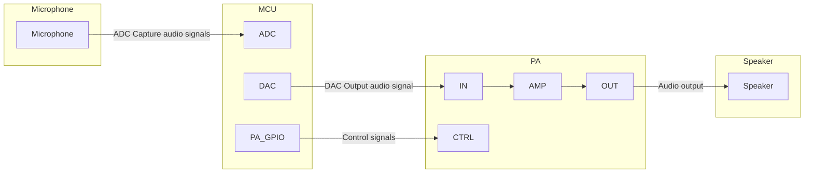
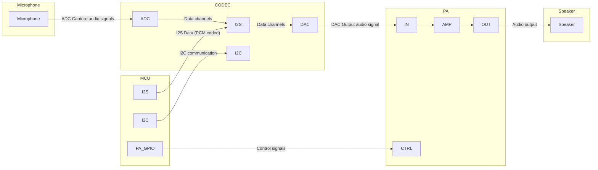
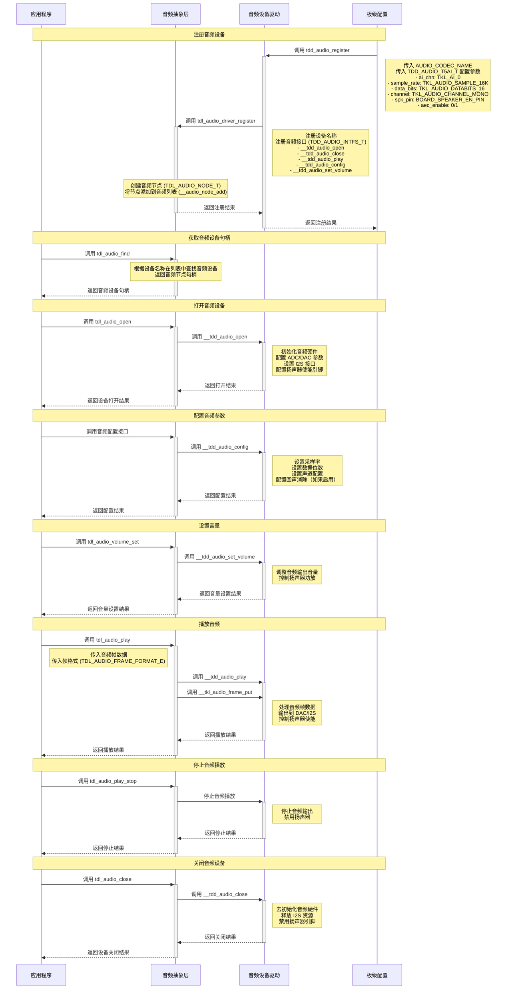

# 音频驱动

## 简介
[音频驱动](https://github.com/tuya/TuyaOpen/tree/master/src/peripherals/audio_codecs) 是TuyaOpen 中用于处理音频输入和输出的核心组件。它提供了统一的接口来管理不同类型的音频设备，如麦克风和扬声器。通过这个驱动，应用可以轻松地进行音频采集、播放和配置，而无需关心底层硬件的具体实现细节。

## 前置概念

| 名词            | 解释                                                                                                                                                                                                   |
| --------------- | :----------------------------------------------------------------------------------------------------------------------------------------------------------------------------------------------------- |
| MIC(麦克风)     | 麦克风是一种将声音信号转换为电信号的换能器                                                                                                                                                             |
| SPK(扬声器)     | 扬声器是一种将电信号转换成声音信号的器件                                                                                                                                                               |
| CODEC(编解码器) | CODEC 通常包含两个主要部分：<br />**编码器（Encoder）** 将原始数据（如未压缩的音频或视频）转换为另一种格式，以便于存储或传输<br />**解码器（Decoder）** 将编码后的数据还原为原始格式，以便于观看或播放 |
| PA(功率放大器)  | 简称功放，是一种电子器件，主要功能是将输入的弱信号进行功率放大，使其能够驱动功率较大的负载，例如扬声器、天线等                                                                                         |
| PCM             | PCM 是一种将模拟音频信号转换为数字信号的编码方式，原始的 PCM 数据（通常称为 PCM 裸流或 raw data）是未经压缩的，需要经过解码才能播放                                                                    |
| PDM             | PDM 也是一种数字音频编码方式，它的特点是只有一个bit的数据位，通过脉冲的密度来表示模拟信号的强度                                                                                                        |
| I2C             | 主要用于芯片之间的控制信号、配置参数和少量数据的传输，使用 SDA (Serial Data) 和 SCL (Serial Clock) 两根线进行通信                                                                                      |
| I2S             | 专门用于数字音频数据的传输，至少使用三根线，包括 SCK (Serial Clock, 时钟线), WS (Word Select, 字选择线), 和 SD (Serial Data, 数据线)。                                                                 |
| ADC             | 将模拟信号（如声音、光、温度等）转换为数字信号，以便计算机或其他数字系统进行处理、存储和传输。`AD` 转化过程通常包括采样、量化和编码(如 PCM 编码)三个步骤。                                             |
| DAC             | 将数字信号（如来自计算机、MP3播放器等）转换为模拟信号，以便驱动扬声器、显示器等模拟设备。`DA` 转化过程通常根据数字信号的值，产生相应的模拟电压或电流输出。                                             |

## 音频连接框架

根据主控芯片的不同，音频连接框架也会有所不同。如 `T5AI` 自带 ADC 和 DAC 接口，不需要 CODEC 芯片也可以实现音频系统。而 `ESP32-S3` 不支持 DAC，需要外挂 CODEC 芯片完成音频系统的搭建。

### 内置 CODEC 的音频设备硬件框架 



### 外置 CODEC 的音频设备硬件框架



## 功能模块

TuyaOpen 旨在提供一个标准化的、与平台无关的音频解决方案，核心的设计思想是分层解耦。它将应用层对音频的需求与底层具体的硬件实现分离开。

 * **对应用开发者而言**：无论底层用的是 T5AI 芯片还是其他芯片的音频编解码器（CODEC），应用层都只需要调用一套统一的、标准化的 API（tdl_audio_xxx 系列函数），如 tdl_audio_open, tdl_audio_play 等。这大大降低了应用开发的复杂性，提高了代码的可移植性。
 * **对驱动开发者而言**：当需要支持一款新的音频芯片时，只需要遵 `tdl_audio_driver.h` 定义的标准接口，编写一个新的 TDD 层驱动（类似 `tdd_audio.c`），然后注册到TDL管理层即可，无需改动任何应用层代码。

### 抽象管理模块：TDL (Tuya Driver Layer)

这是最高层的抽象，面向应用层提供统一的音频服务接口。

* tdl_audio_manage.c/h: 实现了音频驱动的管理核心。它维护一个链表，用于注册和管理不同类型（或不同平台）的音频设备驱动。应用通过调用tdl_audio_find、tdl_audio_open 等函数来使用音频功能，而无需关心底层的具体实现。
* tdl_audio_driver.h: 定义了所有音频设备驱动必须遵守的“标准化接口”(TDD_AUDIO_INTFS_T)，包括open, play, config, close等函数指针。这确保了tdl_audio_manage可以统一地调用任何符合该标准的底层驱动。


### 实例化注册模块：TDD (Tuya Device Driver)

这是驱动的中间层，是特定硬件平台的具体实现。

* tdd_audio.c/h: 针对不同平台的音频驱动实现。它负责承上启下，向上实现了 TDL 所定义的 TDD_AUDIO_INTFS_T 标准接口；向下调用 TKL 层或者原厂提供的硬件抽象接口来控制真实的硬件。tdd_audio_register 函数会将这个驱动的实现（函数指针）注册到 TDL 层。

## 功能介绍

**a. 音频输入（麦克风采集）**

 * 启动和关闭：可以通过 tdl_audio_open 和 tdl_audio_close 来启动和停止音频采集。
 * 异步数据回调：驱动采用回调机制（TDL_AUDIO_MIC_CB）将采集到的音频数据实时地、一帧一帧地推送给应用层。应用层无需主动去读取数据，而是被动接收，效率更高。
 * 状态通知：回调函数不仅传递音频数据，还传递当前的状态（TDL_AUDIO_STATUS_E），例如可以通知应用“语音活动开始（VAD_START）”或“语音活动结束（VAD_END）”。

**b. 音频输出（扬声器播放）**

 * 播放音频流：应用层可以通过调用 tdl_audio_play 函数，将 PCM 等格式的音频数据块发送给驱动，驱动会将其送到硬件进行播放。
 * 控制播放：可以随时调用 tdl_audio_play_stop 来清除播放缓冲区，立即停止当前正在播放音频。

**c. 音量控制**

 * 设置音量：可以通过 tdl_audio_volume_set 函数在运行时动态调整扬声器的播放音量（范围0-100）。

**d. 回声消除（AEC）支持**

 * 可配置的AEC：在初始化音频设备时，可以通过配置项（aec_enable）来选择是否开启声学回声消除功能（需要硬件设备支持）。
 * 提升通话体验：AEC是实现全双工语音通话（即同时说和听而不产生回声）的关键技术。该驱动内置了对AEC的支持，使其能够满足语音对讲、视频通话等高级应用的需求。

**e. 可扩展的驱动管理**
 * 动态注册与发现：系统可以同时注册多个不同的音频驱动（例如，一个板载Codec，一个外置USB声卡）。
 * 按名查找：应用层可以通过一个字符串名称（例如"audio_codec"）来查找并获取特定音频设备的句柄（tdl_audio_find），实现了灵活的设备选择。

## 支持外设列表

| CODEC  | 录音  | 播放  |
| :----: | :---: | :---: |
| ES8311 |   ✅   |   ✅   |
| ES8388 |   ✅   |   ✅   |
| ES8389 |   ✅   |   ✅   |
|  ···   |       |       |

## 工作流程

以 T5AI 为例，介绍音频驱动框架工作流程。



## 开发指导

### Kconfig 配置

如果想要将驱动加入编译，需要在编译前检查是否开启相关 Kconfig 选项。在目标工程路径下，终端执行 `tos.py config menu` 查看以下配置选项。

| 配置宏                  | 类型   | 说明                               |
| :---------------------- | :----- | ---------------------------------- |
| enable audio codecs     | 布尔   | 该宏被打开，驱动代码才会参与编译。 |
| audio support AEC       | 布尔   | 使能 AEC 功能（需要硬件支持）      |
| the name of audio codec | 字符串 | 配置 CODEC 的设备名                |
| the num of audio codecs | 整型   | 配置板级 CODEC 数量                |


:::tip
以上配置项须在 `src/peripherals/audio_codecs/Kconfig` 和 `boards/<target_platform>/<target_board>/Kconfig` （选择自己目标开发板查看 Kconfig 文件）中支持，若没有发现相关配置项，请检查这两个文件内容。
:::

### 运行环境

如果想要运行该驱动，需要先把驱动的 **总使能宏** < `ENABLE_AUDIO_CODECS` > 打开。打开该使能宏的方式有三种， **Board 默认打开**，**开启了需要屏幕驱动的功能** 和 **手动打开**。

:::warning

以下所有命令都是需要切到目标应用目录下执行的，请勿直接在 TuyaOpen 根目录下或者其他目录下执行，否则执行会报错。

:::

#### 目标 Board 默认打开

:::info

这种情况下一般是开发者选择的开发板已经注册好了屏幕设备。这个时候目标 Board 里的源文件中已经写好注册代码， 

例，TUYA_T5AI_EVB 开发板支持麦克风和扬声器，在适配这块开发板时就已经注册好了音频设备 `boards/T5AI/TUYA_T5AI_EVB/Kconfig` 文件也会写上 `select ENABLE_AUDIO_CODECS`。 ( 具体示例代码和配置可参考 `boards/T5AI/TUYA_T5AI_EVB`)。

:::

即只要开发者选择好对应的目标 Board，该驱动会自动被使能。

- 执行进入 Kconfig 菜单命令

  ```shell
  tos.py config menu
  ```

:::warning

boards/T5AI/TUYA_T5AI_EVB/Kconfig 中执行了 `select ENABLE_XXX` 后，执行 `tos.py config menu` 无法手动选择/取消。

:::
#### 开启了需要音频驱动的功能

如果开发者选择了依赖音频驱动的功能，则音频驱动的使能宏也会被自动打开。

#### 手动打开使能宏

- 执行进入 Kconfig 菜单命令

  ```shell
  tos.py config menu
  ```

- 打开驱动使能宏


### 使用方法

#### 适配音频驱动

:::tip

开发者如果在 [tdd_audio](https://github.com/tuya/TuyaOpen/tree/master/boards/ESP32/common/audio) 中找到了对应的驱动可忽略这一步, 如果没有找到适合自己的音频驱动, 可自行适配驱动。

:::

1. 在 `src/peripherals/audio_codecs/tdd_audio` 中新建 `tdd_audio_xxx.c/h` 文件。
2. 为设备 **分配内存**，根据自己的设备适配音频驱动的抽象接口（open，close，play，config 等函数指针）。
3. 调用 **注册通用音频设备节点** 接口(tdl_audio_driver_register())。
4. 示例代码可参考已经适配好的驱动。

```c
OPERATE_RET tdd_audio_register(char *name, TDD_AUDIO_T5AI_T cfg)
{
    OPERATE_RET rt = OPRT_OK;
    
    TDD_AUDIO_DATA_HANDLE_T *_hdl = NULL;
    TDD_AUDIO_INTFS_T intfs = {0};

    /* Allocate memory to the device */
    _hdl = (TDD_AUDIO_DATA_HANDLE_T *)tal_malloc(sizeof(TDD_AUDIO_DATA_HANDLE_T));
    memset(_hdl, 0, sizeof(TDD_AUDIO_DATA_HANDLE_T));
    g_tdd_audio_hdl = _hdl;
    _hdl->play_volume = 80;
    memcpy(&_hdl->cfg, &cfg, sizeof(TDD_AUDIO_T5AI_T));

    /* Register function pointers */
    intfs.open = __tdd_audio_open;
    intfs.play = __tdd_audio_play;
    intfs.config = __tdd_audio_config;
    intfs.close = __tdd_audio_close;

    tdl_audio_driver_register(name, &intfs, (TDD_AUDIO_HANDLE_T)_hdl);
    return rt;
}
```

:::warning

在适配 ESP32 时，需要在 `boards/ESP32/common/audio` 路径下新建文件，已经适配 ESP32 的 CODEC 芯片也在该路径下。

:::

#### 注册音频设备

:::tip

如果开发者选择的目标 Board 中已经注册好了音频设备，则只需要在 Kconfig 中选择该目标板，应用上调用 `board_register_hardware()` 接口即可，该接口中已经注册好对应的音频设备。

:::

1. 根据开发者音频 CODEC 的型号与连接引脚编写注册接口。建议写在 `board_register_hardware()` 中，该接口实现的路径为 `boards/<target_platform>/<target_board>/xxx.c`。
1. 配置设备的基本信息，在 `board_register_hardware()` 中调用注册接口。


```c
OPERATE_RET __board_register_audio(void)
{
    /* Write your struct configuration information here */
    /* begin */
    
    /* end */
    TUYA_CALL_ERR_RETURN(tdd_audio_register(AUDIO_CODEC_NAME, cfg));
    return rt;
}

OPERATE_RET board_register_hardware(void)
{
	TUYA_CALL_ERR_LOG(__board_register_audio());
	return rt;
}
```

#### 控制设备

根据 `src/peripherals/audio_codecs/tdl_audio/include/tdl_audio_manage.h` 中提供的 tdl 层接口，实现对音频设备的控制。

- 根据设备名称找到设备句柄
- 打开并初始化音频设备
- 关闭音频设备并释放相关资源
- 动态调节音频输出音量
- 播放音频数据
- 停止播放音频数据

具体的示例可以参考 `examples/multimedia/audio`。

## 接口说明

### 音频设备配置结构体

以 T5AI 为例，构建 TDD 层硬件配置信息结构体。

```c
/**
 * @brief Audio device configuration structure for T5AI board.
 * 
 * This structure contains all hardware configuration parameters for the audio device,
 * including sample rate, data bits, channels, speaker control pins, and AEC settings.
 */
typedef struct {
    uint8_t aec_enable;
    TKL_AI_CHN_E ai_chn;
    TKL_AUDIO_SAMPLE_E sample_rate;
    TKL_AUDIO_DATABITS_E data_bits;
    TKL_AUDIO_CHANNEL_E channel;

    // spk
    TKL_AUDIO_SAMPLE_E spk_sample_rate;
    int spk_pin;
    int spk_pin_polarity;
} TDD_AUDIO_T5AI_T;
```

### 音频驱动注册结构体

为音频驱动注册结构体，开发者需要根据自己的音频驱动实现对应的函数指针。

```c
/**
 * @brief Audio driver interface structure.
 * 
 * This structure contains function pointers for all audio operations, providing
 * a unified interface for the audio abstract layer to call driver functions.
 */
typedef struct {
    OPERATE_RET (*open)(TDD_AUDIO_HANDLE_T handle, TDL_AUDIO_MIC_CB mic_cb);
    OPERATE_RET (*play)(TDD_AUDIO_HANDLE_T handle, uint8_t *data, uint32_t len);
    OPERATE_RET (*config)(TDD_AUDIO_HANDLE_T handle, TDD_AUDIO_CMD_E cmd, void *args);
    OPERATE_RET (*close)(TDD_AUDIO_HANDLE_T handle);
} TDD_AUDIO_INTFS_T;
```

### 音频设备注册接口

该接口用于将音频设备驱动注册到系统中，是音频驱动框架的入口点。通过传入设备名称和配置参数，将音频设备添加到管理列表中供应用程序使用。

```c
/**
 * @brief Registers an audio device driver with the audio management system.
 * 
 * This function registers an audio device driver including device name, hardware 
 * configuration parameters, and driver interface functions. After successful 
 * registration, applications can find and use the audio device by name.
 * 
 * @param name Audio device name used for identification and lookup
 * @param cfg Audio device configuration parameters including sample rate, data bits, 
 *            channels, speaker pin configuration, etc.
 * 
 * @return Returns OPRT_OK on successful registration, or an appropriate error code on failure.
 */
OPERATE_RET tdd_audio_register(const char *name, TDD_AUDIO_T5AI_T cfg);
```

### 音频驱动注册接口

该接口将底层音频驱动接口注册到抽象层管理系统中，创建设备节点并维护设备列表。

```c
/**
 * @brief Registers audio device driver interfaces to the abstract layer management system.
 * 
 * This function registers audio device driver interface functions to the audio abstract 
 * layer management system, creates device nodes and adds them to the device management list 
 * for upper layer application calls.
 * 
 * @param name Audio device name
 * @param intfs Audio driver interface structure containing various operation function pointers
 * 
 * @return Returns OPRT_OK on successful registration, or an appropriate error code on failure.
 */
OPERATE_RET tdl_audio_driver_register(const char *name, TDD_AUDIO_INTFS_T *intfs);

```

### 设备查找与管理接口

该接口根据设备名称在已注册的音频设备列表中查找对应的设备句柄，是获取设备控制权的关键接口。

```c
/**
 * @brief Finds an audio device by device name.
 * 
 * This function searches for the corresponding audio device node in the registered 
 * audio device list based on the device name, and returns a device handle for 
 * subsequent operations.
 * 
 * @param name Name of the audio device to find
 * 
 * @return Returns audio device handle, or NULL if not found.
 */
TDL_AUDIO_HANDLE_T tdl_audio_find(const char *name);

```

### 设备开启接口

该接口打开并初始化音频设备，包括硬件初始化、引脚配置等操作，使设备进入可用状态。

```c
/**
 * @brief Opens and initializes an audio device.
 * 
 * This function opens the specified audio device and initializes audio hardware 
 * including ADC/DAC, I2S interface, speaker enable pins, etc. After successful 
 * opening, the device enters a usable state.
 * 
 * @param audio_hdl Audio device handle
 * 
 * @return Returns OPRT_OK on successful opening, or an appropriate error code on failure.
 */
OPERATE_RET tdl_audio_open(TDL_AUDIO_HANDLE_T audio_hdl);

```

### 设备关闭接口

该接口关闭音频设备并释放相关资源，包括去初始化硬件、禁用引脚等清理工作。

```c
/**
 * @brief Closes and deinitializes an audio device.
 * 
 * This function closes the specified audio device and deinitializes audio hardware 
 * including releasing I2S resources, disabling speaker pins, closing ADC/DAC, etc. 
 * After closing, the device becomes unavailable and needs to be reopened for use.
 * 
 * @param audio_hdl Audio device handle
 * 
 * @return Returns OPRT_OK on successful closing, or an appropriate error code on failure.
 */
OPERATE_RET tdl_audio_close(TDL_AUDIO_HANDLE_T audio_hdl);

```

### 音量调节接口

该接口用于动态调节音频输出音量，控制扬声器功放增益。

```c
/**
 * @brief Sets audio output volume.
 * 
 * This function adjusts the output volume of the audio device, controls the gain 
 * of the speaker amplifier, and implements dynamic volume adjustment functionality.
 * 
 * @param audio_hdl Audio device handle
 * @param volume Volume value, typically ranging from 0-100
 * 
 * @return Returns OPRT_OK on successful setting, or an appropriate error code on failure.
 */
OPERATE_RET tdl_audio_volume_set(TDL_AUDIO_HANDLE_T audio_hdl, uint8_t volume);

```

### 音频播放控制接口

该接口用于播放音频数据，将音频帧通过硬件接口输出到扬声器。

```c
/**
 * @brief Plays audio data.
 * 
 * This function sends audio frame data to the audio device for playback. Data is 
 * output to the speaker through DAC or I2S interface. Supports different audio 
 * frame formats.
 * 
 * @param audio_hdl Audio device handle
 * @param frame_data Audio frame data pointer
 * @param frame_size Audio frame data size
 * @param format Audio frame format
 * 
 * @return Returns OPRT_OK on successful playback, or an appropriate error code on failure.
 */
OPERATE_RET tdl_audio_play(TDL_AUDIO_HANDLE_T audio_hdl, void *frame_data, uint32_t frame_size,
                           TDL_AUDIO_FRAME_FORMAT_E format);

```

### 音频停止播放接口

该接口用于停止当前音频播放，关闭音频输出并使设备进入静音状态。

```c
/**
 * @brief Stops audio playback.
 * 
 * This function stops the currently ongoing audio playback, closes audio output, 
 * disables speaker amplifier, and puts the device into a mute state.
 * 
 * @param audio_hdl Audio device handle
 * 
 * @return Returns OPRT_OK on successful stopping, or an appropriate error code on failure.
 */
OPERATE_RET tdl_audio_play_stop(TDL_AUDIO_HANDLE_T audio_hdl);

```

