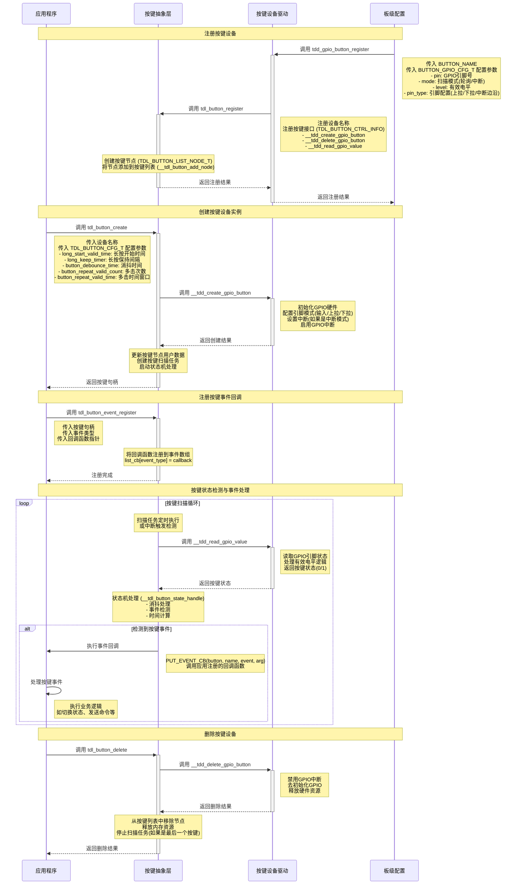
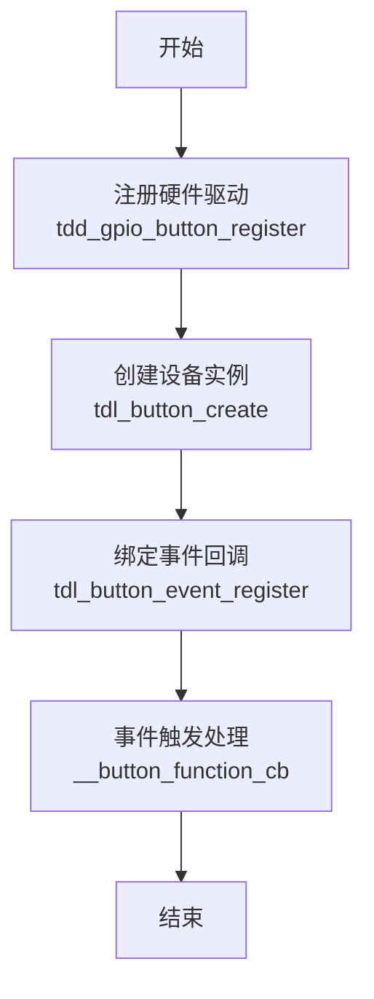

# 按键驱动

## 简介
[按键驱动](https://github.com/tuya/TuyaOpen/tree/master/src/peripherals/button) 是 TuyaOpen 中用于处理用户输入的核心组件。它提供了统一的接口来管理不同类型的按键设备，支持多种按键事件检测和处理机制。通过这个驱动，应用可以轻松地实现按键输入检测、事件处理和状态管理，而无需关心底层硬件的具体实现细节。

## 前置概念

| 名词      | 解释                                                         |
| --------- | :----------------------------------------------------------- |
| GPIO      | 通用输入输出引脚，用于连接按键等外部设备                     |
| 消抖      | 按键在按下或松开时会产生机械抖动，需要通过软件或硬件方式消除 |
| 上拉/下拉 | GPIO引脚的电平配置方式，用于确定按键未按下时的默认状态       |
| 中断      | 硬件事件触发的异步通知机制，可实现低功耗的按键检测           |
| 轮询      | 定时检查按键状态的检测方式，适用于简单应用场景               |
| 有效电平  | 按键按下时GPIO引脚的电平状态，可配置为高电平或低电平有效     |
| 边沿触发  | 中断触发方式，可配置为上升沿、下降沿或双边沿触发             |
| 状态机    | 用于管理按键事件检测和处理的逻辑控制机制                     |

## 按键连接框架

根据硬件设计的不同，按键连接方式也会有所不同。常见的连接方式包括上拉按键和下拉按键两种。

### 上拉按键连接框架


### 下拉按键连接框架


## 功能模块

TuyaOpen 旨在提供一个标准化的、与平台无关的按键解决方案，核心的设计思想是分层解耦。它将应用层对按键的需求与底层具体的硬件实现分离开。

 * **对应用开发者而言**：无论底层用的是什么芯片的GPIO，应用层都只需要调用一套统一的、标准化的 API（tdl_button_xxx 系列函数），如 tdl_button_create, tdl_button_event_register 等。这大大降低了应用开发的复杂性，提高了代码的可移植性。
 * **对驱动开发者而言**：当需要支持一款新的硬件平台时，只需要遵循 `tdl_button_driver.h` 定义的标准接口，编写一个新的 TDD 层驱动（类似 `tdd_button_gpio.c`），然后注册到TDL管理层即可，无需改动任何应用层代码。

### 抽象管理模块：TDL (Tuya Driver Layer)

这是最高层的抽象，面向应用层提供统一的按键服务接口。

* tdl_button_manage.c/h: 实现了按键驱动的管理核心。它维护一个链表，用于注册和管理不同类型（或不同平台）的按键设备驱动。应用通过调用 tdl_button_create、tdl_button_event_register 等函数来使用按键功能，而无需关心底层的具体实现。
* tdl_button_driver.h: 定义了所有按键设备驱动必须遵守的"标准化接口"(TDL_BUTTON_CTRL_INFO)，包括 button_create, button_delete, read_value等函数指针。这确保了 tdl_button_manage 可以统一地调用任何符合该标准的底层驱动。

### 实例化注册模块：TDD (Tuya Device Driver)

这是驱动的中间层，是特定硬件平台的具体实现。

* tdd_button_gpio.c/h: 针对GPIO按键的驱动实现。它负责承上启下，向上实现了 TDL 所定义的 TDL_BUTTON_CTRL_INFO 标准接口；向下调用 TKL 层的GPIO接口来控制真实的硬件。tdd_gpio_button_register 函数会将这个驱动的实现（函数指针）注册到 TDL 层。

## 功能介绍

**a. 按键事件检测**

 * 多种事件类型：支持按下、松开、单击、双击、多击、长按开始、长按保持等多种按键事件。
 * 异步事件回调：驱动采用回调机制（TDL_BUTTON_EVENT_CB）将检测到的按键事件实时推送给应用层。应用层无需主动轮询按键状态，而是被动接收事件通知，效率更高。
 * 状态机处理：内部使用状态机来管理按键的各种状态转换，确保事件检测的准确性和可靠性。

**b. 按键扫描模式**

 * 定时扫描模式：通过定时器定期检查按键状态，适用于对功耗要求不高的应用场景。
 * 中断扫描模式：利用GPIO中断机制检测按键状态变化，实现低功耗的按键检测，适用于电池供电设备。

**c. 消抖处理**

 * 软件消抖：通过可配置的消抖时间参数，有效消除按键机械抖动带来的误触发。
 * 灵活配置：消抖时间可根据不同按键的特性进行个性化配置。

**d. 长按功能**

 * 可配置的长按检测：支持配置长按开始时间和长按保持触发间隔。
 * 长按事件分离：区分长按开始事件和长按保持事件，满足不同应用需求。

**e. 多击检测**

 * 双击/多击支持：支持双击和多击事件检测，可配置多击的有效次数和时间窗口。
 * 灵活的时间配置：可配置多击事件的有效时间间隔。

**f. 可扩展的驱动管理**
 * 动态注册与发现：系统可以同时注册多个不同的按键驱动。
 * 按名查找：应用层可以通过一个字符串名称来查找并获取特定按键设备的句柄，实现了灵活的设备选择。

## 支持外设列表

|   按键类型   | 轮询扫描 | 中断扫描 |
| :----------: | :------: | :------: |
|   GPIO按键   |    ✅     |    ✅     |
|   矩阵键盘   |    ✅     |    ✅     |
| 电容触摸按键 |    ❌     |    ❌     |
|   ADC按键    |    ❌     |    ❌     |

## 工作流程

以 GPIO 按键为例，介绍按键驱动框架工作流程。



## 开发指导

### Kconfig 配置

如果想要将驱动加入编译，需要在编译前检查是否开启相关 Kconfig 选项。在目标工程路径下，终端执行 `tos.py config menu` 查看以下配置选项。

| 配置宏               | 类型   | 说明                               |
| :------------------- | :----- | ---------------------------------- |
| enable button        | 布尔   | 该宏被打开，驱动代码才会参与编译。 |
| the num of button    | 整型   | 配置按键数量                       |
| the name of button 1 | 字符串 | 配置第一个按键的设备名             |
| the name of button 2 | 字符串 | 配置第二个按键的设备名             |
| the name of button 3 | 字符串 | 配置第三个按键的设备名             |
| the name of button 4 | 字符串 | 配置第四个按键的设备名             |


:::tip
以上配置项须在 `src/peripherals/button/Kconfig` 和 `boards/<target_platform>/<target_board>/Kconfig` （选择自己目标开发板查看 Kconfig 文件）中支持，若没有发现相关配置项，请检查这两个文件内容。
:::

### 运行环境

如果想要运行该驱动，需要先把驱动的 **总使能宏** < `ENABLE_BUTTON` > 打开。打开该使能宏的方式有三种， **Board 默认打开**，**开启了需要按键驱动的功能** 和 **手动打开**。

:::warning

以下所有命令都是需要切到目标应用目录下执行的，请勿直接在 TuyaOpen 根目录下或者其他目录下执行，否则执行会报错。

:::

#### 目标 Board 默认打开

:::info

这种情况下一般是开发者选择的开发板已经注册好了按键设备。这个时候目标 Board 里的源文件中已经写好注册代码， 

例，TUYA_T5AI_BOARD 开发板支持用户按键，在适配这块开发板时就已经注册好了按键设备，boards/T5AI/TUYA_T5AI_BOARD/Kconfig 文件也会写上 `select ENABLE_BUTTON`。

:::

即只要开发者选择好对应的目标 Board，该驱动会自动被使能。

- 执行进入 Kconfig 菜单命令

  ```shell
  tos.py config menu
  ```

:::warning

`boards/<platform>/<target_board>/Kconfig` 中执行了 `select ENABLE_XXX` 后，执行 `tos.py config menu` 无法手动选择/取消。

:::

#### 开启了需要按键驱动的功能

如果开发者选择了依赖按键驱动的功能，则按键驱动的使能宏也会被自动打开。

#### 手动打开使能宏

- 执行进入 Kconfig 菜单命令

  ```shell
  tos.py config menu
  ```

- 打开驱动使能宏


### 使用方法

#### 适配按键驱动

:::tip

开发者如果在现有的按键驱动中找到了对应的驱动可忽略这一步, 如果没有找到适合自己的按键驱动, 可自行适配驱动。

:::

1. 在 `src/peripherals/button/tdd_button` 中新建 `tdd_button_xxx.c/h` 文件。
2. 为设备 **分配内存**，根据自己的设备适配按键驱动的抽象接口（button_create，button_delete，read_value 等函数指针）。
3. 调用 **注册通用按键设备节点** 接口(tdl_button_register())。
4. 示例代码可参考已经适配好的 GPIO 按键驱动。

具体的示例可以参考 `examples/peripherals/button`。

#### 注册按键设备

:::tip

如果开发者选择的目标 Board 中已经注册好了按键设备，则只需要在 Kconfig 中选择该目标板，应用上调用 `board_register_hardware()` 接口即可，该接口中已经注册好对应的按键设备。

:::

1. 根据开发者按键的型号与连接引脚编写注册接口。建议写在 `board_register_hardware()` 中，该接口实现的路径为 `boards/<target_platform>/<target_board>/xxx.c`。
2. 配置设备的基本信息，在 `board_register_hardware()` 中调用注册接口。

```c
OPERATE_RET __board_register_button(void)
{
    /* Write your struct configuration information here */
    /* begin */

    /* end */
    TUYA_CALL_ERR_RETURN(tdd_gpio_button_register(BUTTON_NAME, &button_cfg));
    return OPRT_OK;
}

OPERATE_RET board_register_hardware(void)
{
    TUYA_CALL_ERR_LOG(__board_register_button());
    return OPRT_OK;
}
```

#### 控制设备

根据 `src/peripherals/button/tdl_button/include/tdl_button_manage.h` 中提供的 tdl 层接口，实现对按键设备的控制。

- 创建按键设备实例并配置参数
- 注册按键事件回调函数
- 处理按键事件
- 删除按键设备实例

## 开发流程

用户只需要通过几个简单的API就可以完成按键外设的开发。



关于按键的例程在 `examples/peripherals/button` 路径下，开发者可以在提供的例程基础上进行修改。


## 接口说明

### 按键设备配置结构体

以 GPIO 按键为例，构建 TDD 层硬件配置信息结构体。

```c
/**
 * @brief GPIO button configuration structure.
 * 
 * This structure contains all hardware configuration parameters for GPIO button,
 * including pin number, operation mode, active level, and pin type settings.
 */
typedef struct {
    TUYA_GPIO_NUM_E pin;           // GPIO pin number
    TUYA_GPIO_LEVEL_E level;       // Active level (HIGH/LOW)
    TDD_GPIO_TYPE_U pin_type;      // Pin configuration (pull-up/pull-down for scan mode, edge type for IRQ mode)
    TDL_BUTTON_MODE_E mode;        // Button operation mode (timer scan or interrupt)
} BUTTON_GPIO_CFG_T;

typedef union {
    TUYA_GPIO_MODE_E gpio_pull;    // GPIO pull mode for BUTTON_TIMER_SCAN_MODE
    TUYA_GPIO_IRQ_E irq_edge;      // IRQ edge type for BUTTON_IRQ_MODE
} TDD_GPIO_TYPE_U;
```

### 按键软件配置结构体

用于配置按键的软件参数，包括消抖时间、长按时间等。

```c
/**
 * @brief Button software configuration structure.
 * 
 * This structure contains software configuration parameters for button behavior,
 * including debounce time, long press timing, and multi-click settings.
 */
typedef struct {
    uint16_t long_start_valid_time;    // Long press start valid time (ms)
    uint16_t long_keep_timer;          // Long press hold trigger interval (ms)
    uint16_t button_debounce_time;     // Button debounce time (ms)
    uint8_t button_repeat_valid_count; // Multi-click count threshold
    uint16_t button_repeat_valid_time; // Multi-click valid time window (ms)
} TDL_BUTTON_CFG_T;
```

### 按键事件枚举

定义按键支持的所有事件类型。

```c
/**
 * @brief Button event types enumeration.
 * 
 * This enumeration defines all supported button event types that can be
 * detected and reported to the application layer.
 */
typedef enum {
    TDL_BUTTON_PRESS_DOWN = 0,     // Press down trigger
    TDL_BUTTON_PRESS_UP,           // Release trigger
    TDL_BUTTON_PRESS_SINGLE_CLICK, // Single click trigger
    TDL_BUTTON_PRESS_DOUBLE_CLICK, // Double click trigger
    TDL_BUTTON_PRESS_REPEAT,       // Multiple click trigger
    TDL_BUTTON_LONG_PRESS_START,   // Long press start trigger
    TDL_BUTTON_LONG_PRESS_HOLD,    // Long press hold trigger
    TDL_BUTTON_RECOVER_PRESS_UP,   // Recovery press up trigger
    TDL_BUTTON_PRESS_MAX,          // Maximum event count
    TDL_BUTTON_PRESS_NONE,         // No event
} TDL_BUTTON_TOUCH_EVENT_E;
```

### 按键驱动注册结构体

为按键驱动注册结构体，开发者需要根据自己的按键驱动实现对应的函数指针。

```c
/**
 * @brief Button driver interface structure.
 * 
 * This structure contains function pointers for all button operations, providing
 * a unified interface for the button abstract layer to call driver functions.
 */
typedef struct {
    OPERATE_RET (*button_create)(TDL_BUTTON_OPRT_INFO *dev);
    OPERATE_RET (*button_delete)(TDL_BUTTON_OPRT_INFO *dev);
    OPERATE_RET (*read_value)(TDL_BUTTON_OPRT_INFO *dev, uint8_t *value);
} TDL_BUTTON_CTRL_INFO;
```

### 按键设备注册接口

该接口用于将按键设备驱动注册到系统中，是按键驱动框架的入口点。通过传入设备名称和配置参数，将按键设备添加到管理列表中供应用程序使用。

```c
/**
 * @brief Registers a GPIO button device driver with the button management system.
 * 
 * This function registers a GPIO button device driver including device name and 
 * hardware configuration parameters. After successful registration, applications 
 * can create button instances and use the button device by name.
 * 
 * @param name Button device name used for identification and lookup
 * @param gpio_cfg GPIO button configuration parameters including pin number, 
 *                 operation mode, active level, and pin type settings
 * 
 * @return Returns OPRT_OK on successful registration, or an appropriate error code on failure.
 */
OPERATE_RET tdd_gpio_button_register(char *name, BUTTON_GPIO_CFG_T *gpio_cfg);
```

### 按键驱动注册接口

该接口将底层按键驱动接口注册到抽象层管理系统中，创建设备节点并维护设备列表。

```c
/**
 * @brief Registers button device driver interfaces to the abstract layer management system.
 * 
 * This function registers button device driver interface functions to the button abstract 
 * layer management system, creates device nodes and adds them to the device management list 
 * for upper layer application calls.
 * 
 * @param name Button device name
 * @param button_ctrl_info Button driver interface structure containing various operation function pointers
 * @param button_cfg_info Button device configuration information
 * 
 * @return Returns OPRT_OK on successful registration, or an appropriate error code on failure.
 */
OPERATE_RET tdl_button_register(char *name, TDL_BUTTON_CTRL_INFO *button_ctrl_info,
                                TDL_BUTTON_DEVICE_INFO_T *button_cfg_info);
```

### 设备创建接口

该接口创建按键设备实例并配置软件参数，使设备进入可用状态。

```c
/**
 * @brief Creates a button device instance with specified configuration.
 * 
 * This function creates a button device instance based on the registered button driver,
 * configures software parameters such as debounce time and long press timing, and 
 * initializes the button hardware. After successful creation, the device enters a usable state.
 * 
 * @param name Button device name (must match registered name)
 * @param button_cfg Button software configuration parameters
 * @param handle Pointer to store the returned button device handle
 * 
 * @return Returns OPRT_OK on successful creation, or an appropriate error code on failure.
 */
OPERATE_RET tdl_button_create(char *name, TDL_BUTTON_CFG_T *button_cfg, TDL_BUTTON_HANDLE *handle);
```

### 设备删除接口

该接口删除按键设备实例并释放相关资源，包括去初始化硬件、禁用引脚等清理工作。

```c
/**
 * @brief Deletes a button device instance and releases related resources.
 * 
 * This function deletes the specified button device instance, deinitializes button hardware 
 * including disabling GPIO interrupts, releasing GPIO resources, and removing the device 
 * from the management list. After deletion, the device becomes unavailable.
 * 
 * @param handle Button device handle
 * 
 * @return Returns OPRT_OK on successful deletion, or an appropriate error code on failure.
 */
OPERATE_RET tdl_button_delete(TDL_BUTTON_HANDLE handle);
```

### 事件回调注册接口

该接口用于注册按键事件回调函数，当检测到对应事件时会调用注册的回调函数。

```c
/**
 * @brief Registers an event callback function for a specific button event.
 * 
 * This function registers a callback function for a specific button event type. When the 
 * specified event is detected, the registered callback function will be called with event 
 * information and parameters.
 * 
 * @param handle Button device handle
 * @param event Button event type to register callback for
 * @param cb Callback function pointer to be called when event occurs
 * 
 * @return None
 */
void tdl_button_event_register(TDL_BUTTON_HANDLE handle, TDL_BUTTON_TOUCH_EVENT_E event, TDL_BUTTON_EVENT_CB cb);
```

### 按键状态读取接口

该接口用于读取按键的当前状态。

```c
/**
 * @brief Reads the current status of a button device.
 * 
 * This function reads the current physical status of the specified button device,
 * returning whether the button is currently pressed or released.
 * 
 * @param handle Button device handle
 * @param status Pointer to store the button status (0: released, 1: pressed)
 * 
 * @return Returns OPRT_OK on successful reading, or an appropriate error code on failure.
 */
OPERATE_RET tdl_button_read_status(TDL_BUTTON_HANDLE handle, uint8_t *status);
```

### 按键电平设置接口

该接口用于动态设置按键的有效电平，适用于拨码开关等应用场景。

```c
/**
 * @brief Sets the active level of a button device.
 * 
 * This function dynamically sets the active level of the specified button device.
 * This is useful for toggle switches where the effective level needs to be changed
 * during runtime.
 * 
 * @param handle Button device handle
 * @param level Active level to set (TUYA_GPIO_LEVEL_HIGH or TUYA_GPIO_LEVEL_LOW)
 * 
 * @return Returns OPRT_OK on successful setting, or an appropriate error code on failure.
 */
OPERATE_RET tdl_button_set_level(TDL_BUTTON_HANDLE handle, TUYA_GPIO_LEVEL_E level);
```

### 扫描时间配置接口

该接口用于配置按键扫描的时间间隔。

```c
/**
 * @brief Sets the button scan time interval.
 * 
 * This function sets the time interval for button scanning. The default scan time
 * is 10ms. Shorter intervals provide better responsiveness but consume more CPU resources.
 * 
 * @param time_ms Button scan time interval in milliseconds
 * 
 * @return Returns OPRT_OK on successful setting, or an appropriate error code on failure.
 */
OPERATE_RET tdl_button_set_scan_time(uint8_t time_ms);
```

### 深度睡眠控制接口

该接口用于控制按键功能的开启和关闭，适用于低功耗应用场景。

```c
/**
 * @brief Controls button functionality for deep sleep scenarios.
 * 
 * This function enables or disables button functionality, which is useful for 
 * power management in battery-powered devices. When disabled, button scanning
 * and event detection are suspended to save power.
 * 
 * @param enable Enable flag (0: disable, 1: enable)
 * 
 * @return Returns OPRT_OK on successful control, or an appropriate error code on failure.
 */
OPERATE_RET tdl_button_deep_sleep_ctrl(uint8_t enable);
```

## 注意事项

### 硬件配置注意事项

- **引脚选择**：确保选择的 GPIO 引脚支持所需的功能（输入、上拉/下拉、中断等）
- **电平配置**：正确配置按键的有效电平，与硬件电路设计保持一致
- **上拉/下拉配置**：根据按键连接方式正确配置内部上拉或下拉电阻
- **中断边沿**：中断模式下需要根据有效电平正确配置中断触发边沿

### 软件配置注意事项

- **消抖时间设置**：建议范围20-50ms，过短可能导致误触发，过长会影响响应速度
- **长按时间配置**：根据用户体验需求合理设置长按开始时间和保持间隔
- **多击时间窗口**：双击/多击的时间窗口应该符合用户操作习惯，通常300-800 ms
- **扫描时间间隔**：默认10ms适用于大多数场景，可根据实际需求调整

### 功耗优化建议

- **中断模式优先**：低功耗场景建议使用中断模式而非轮询扫描
- **深度睡眠控制**：在不需要按键功能时及时关闭以节省功耗
- **扫描频率优化**：适当增加扫描间隔可以降低功耗，但会影响响应速度

### 线程安全注意事项

- **回调函数限制**：避免在回调函数中执行耗时操作，可能会影响其他按键的检测
- **资源竞争**：多个按键共享扫描任务时，注意避免资源竞争问题
- **中断上下文**：中断模式下的回调函数运行在中断上下文中，需要注意中断安全

### 调试建议

- **日志输出**：开启按键相关的调试日志有助于问题定位
- **状态监控**：可以通过 `tdl_button_read_status` 接口监控按键的实时状态
- **事件统计**：在回调函数中添加事件计数，便于验证按键功能是否正常

### 常见问题解决

- **按键无响应**：检查 GPIO 配置、有效电平设置、驱动注册是否正确
- **误触发频繁**：适当增加消抖时间，检查硬件电路是否有干扰
- **长按不触发**：检查长按时间配置是否合理，确认硬件连接稳定
- **双击识别失败**：调整双击时间窗口，确保用户操作在有效时间内
