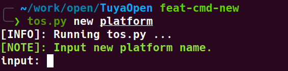
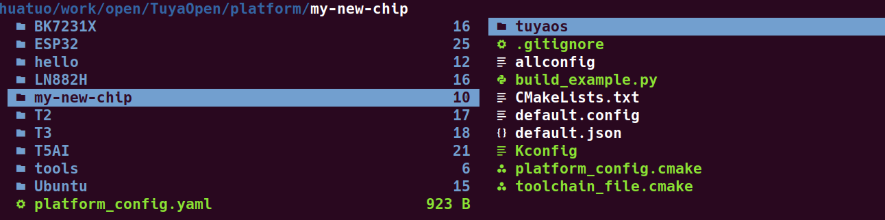
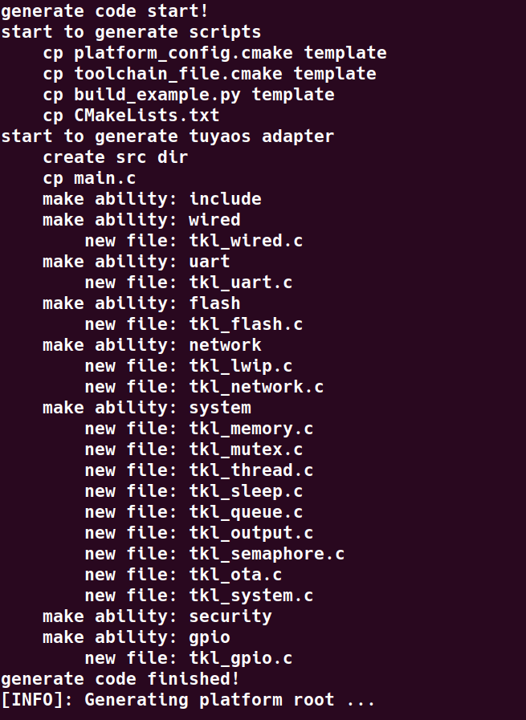
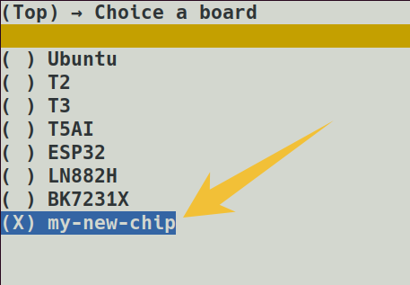

# 创建`platform`

## 概述

使用命令`tos.py new platform`，创建一个新的硬件平台移植模板

这个命令是给希望将涂鸦OS（TuyaOS）移植到一款新的、官方尚未支持的硬件芯片或开发板的开发者使用的。它会自动生成一套完整的、用于适配新硬件的目录结构和基础代码文件

总结：new platform 命令极大地简化了将TuyaOS移植到新硬件的工作量。开发者无需手动创建所有必需的文件和目录，只需运行此命令，然后专注于在生成的模板文件（`.c` 和 `.h`）中实现与具体硬件平台相关的驱动代码即可

## 操作原理

1. 输入命令`tos.py new platform`：会提示你输入新平台的名称（例如 `my_new_chip`）

    

1. 生成Kconfig配置：

    * 创建一个顶层的`Kconfig`文件，用于将新平台集成到项目的配置系统中

    * 弹出一个 `menuconfig` 交互界面，让你选择这个新平台需要支持哪些基础功能（如WIFI, BLE, GPIO, I2C等）。你的选择会保存在一个 `default.config` 文件中。

    

1. 创建平台目录：在 platform/ 目录下创建一个以你输入名称命名的文件夹（`platform/my_new_chip`）

    

1. 复制适配层模板：根据你在上一步的选择，从 `tools/porting/adapter` 目录中复制对应的硬件抽象层（TKL - Tuya Kernel Layer）接口模板到 `platform/my_new_chip/tuyaos/` 目录下。

    * 例如，如果你勾选了WIFI功能，它就会把WIFI相关的 tkl_init_wifi.c 和 tkl_init_wifi.h 等文件的模板复制过去。

    

1. 创建板级配置：在 `boards/` 目录下也创建一个同名文件夹（`boards/my_new_chip`），并生成相应的 `Kconfig` 文件，用于将这个新平台作为可选项添加到编译系统中。

    

1. 编译验证，使用命令`tos.py new project`，创建一个新项目，选择`my_new_chip`平台，使用命令`tos.py build`编译验证。

    

    

## 后续操作

1. 在`platform/my_new_chip/tuyaos/tuyaos_adapter/src`目录下，根据提示，填写实际的硬件驱动代码

1. 修改`platform/my_new_chip/toolchain_file.cmake`文件，配置编译工具的实际路径

1. 修改`platform/my_new_chip/build_example.py`文件，完成编译和链接步骤

## 常见问题
